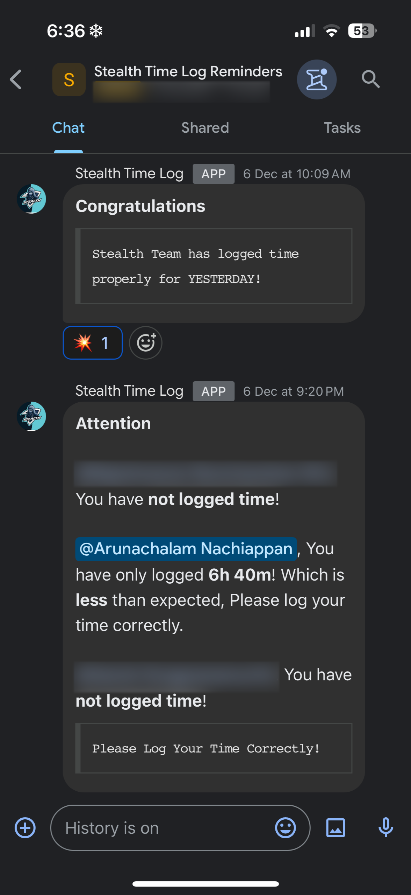

# Jira Time Log Reminder

This project is a Google Apps Script that integrates with Jira and Google Chat to remind team members to log their work hours. It sends notifications to a specified Google Chat space based on the logged work hours in Jira.

## Features

- Sends daily reminders to log work hours.
- Sends sprint closure reminders.
- Checks if the logged hours meet the expected criteria.
- Configurable for different environments (testing, unofficial, official).

## Setup

### Prerequisites

- Google Apps Script account.
- Jira account with API access.
- Google Chat webhook URL.

### Demo
<p align='center'></p>

### Configuration

1. **Clone the repository:**

    ```sh
    git clone https://github.com/yourusername/jira-time-log-reminder.git
    cd jira-time-log-reminder
    ```

2. **Open the script in Google Apps Script:**

    - Go to [Google Apps Script](https://script.google.com/).
    - Create a new project.
    - Copy the contents of `timeLogReminder.js` into the script editor.

3. **Set up environment variables:**

    Update the following variables in `timeLogReminder.js` with your specific details:

    ```javascript
    let MAIL_ID = "your-workplace-email-id";
    let API_TOKEN = "your-jira-api-token";
    let JIRA_PROJECT_NAME = "your-project-board-name";
    let TESTING_SPACE_URL = "your-test-google-chat-webhook-url";
    let OFFICAL_SPACE_URL = "your-google-chat-webhook-url";
    ```

4. **Configure Jira users:**

    Update the `JIRA_PEOPLE` array with the display names and Google Chat IDs of your team members:

    ```javascript
    let JIRA_PEOPLE = [
        {
            NAME: "User-1",
            ID: "google-chat-id-1",
        },
        {
            NAME: "User-2",
            ID: "google-chat-id-2",
        }
    ];
    ```

5. **Set up triggers:**

    Run the `setTrigger` function to set up the necessary time-based triggers.

## Usage

The script will automatically send reminders based on the configured schedule. You can manually run the following functions for testing or immediate execution:

- `morningReminder`: Sends a daily reminder at 9:15 PM.
- `doComplain`: Sends a morning reminder to log time for yesterday or Friday (if Monday).
- `sprintClosureReminder`: Sends a sprint closure reminder on Tuesdays.
